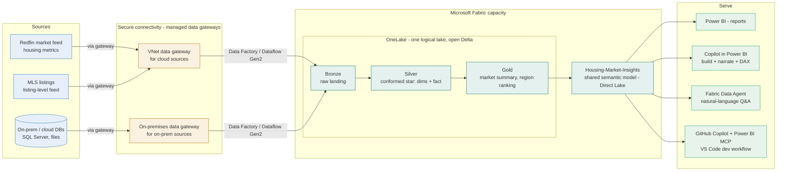

# Target architecture (housing workshop)

The workshop drives toward a **OneLake-centric** estate: the sources land once in
OneLake, and every workload, Power BI, Copilot, and the Data Agent, reads that
single governed copy. This is the shift from a **Tableau + extracts** world
(many `.hyper` extracts, many refresh schedules, logic trapped in workbooks) to
**land once, model once, serve many**. This renders on GitHub.

## How each lab maps onto this picture

| Lab | Part of the diagram it builds |
| --- | --- |
| Day 1 - Lab 0 Setup | Confirms the sandbox and lands the raw data |
| Day 1 - Lab 1 Tableau to Power BI | The mental model: extracts/workbooks -> model + reports |
| Day 1 - Lab 2 Data modeling | The **Silver star** (dims + fact) vs a flat extract |
| Day 1 - Lab 3 Visualization | The **Power BI reports** serve box, viz design |
| Day 1 - Lab 4 Governance foundations | Guardrails around the capacity + workspaces |
| Day 2 - Lab 5 Ingestion | The **source -> Bronze** arrows (Data Factory, gateways) |
| Day 2 - Lab 6 Semantic model | **Gold -> shared semantic model** (Direct Lake) |
| Day 2 - Lab 7 Copilot in reports | The **Copilot in Power BI** serve box |
| Day 2 - Lab 8 Migrate a workbook | A full source-to-report slice, end to end |
| Day 3 - Lab 9 MCP + GitHub Copilot | The **GitHub Copilot + MCP** dev box, PBIP + CI/CD |
| Day 3 - Lab 10 Data Agent | The **Data Agent** serve box |
| Day 3 - Lab 11 Showcase & next steps | The whole picture, plus the adoption roadmap |

## Design choices for a Tableau team

> See also the polished **current-state vs target-state** draw.io diagrams in
> [housing-architecture.md](housing-architecture.md) (editable + PNG).

- **Land once, serve many.** Sources replicate into OneLake; Power BI, Copilot
  and the Data Agent all read the same gold tables. No more one extract per
  workbook.
- **Direct Lake, not Import.** No refresh windows, lower capacity cost, always
  current, the closest thing to a Tableau live connection but on a governed model.
- **Model as a star.** A Tableau extract is often one wide table. Power BI is at
  its best on a [star schema](https://learn.microsoft.com/power-bi/guidance/star-schema);
  Lab 2 makes that switch and it is the single biggest quality lever.
- **Measures defined once.** Business logic (YoY, months of supply) lives in the
  shared model, not copied into every workbook, so numbers agree everywhere.
- **Dev, test, prod are separate** so an experiment cannot disturb the reports
  executives rely on.
