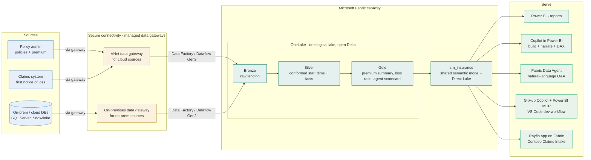

# Target architecture (Contoso Insurance workshop)

The workshop drives toward a **OneLake-centric** estate: the sources land once in
OneLake, and every workload, Power BI, Copilot, the Data Agent, the GitHub
Copilot + MCP developer loop, and even a Rayfin app, reads or writes that single
governed copy. This is the shift from a **Tableau + extracts** world (many
`.hyper` extracts, many refresh schedules, logic trapped in workbooks) to **land
once, model once, serve many**. This renders on GitHub.

> This is the **target** state. Today the estate is flat, most reports import
> from SQL through the on-premises data gateway, and OneLake, Lakehouse, Copilot,
> the Data Agent, and MCP are not approved or enabled for this audience. See
> [schwab-environment-today.md](schwab-environment-today.md) for what is in scope
> hands-on and what is demonstrated.

## How each lab maps onto this picture

| Lab | Part of the diagram it builds |
| --- | --- |
| Day 1 - Lab 0 Setup | Confirms the sandbox, lands the raw data, installs Rayfin |
| Day 1 - Lab 1 Tableau to Power BI | The mental model: extracts/workbooks -> model + reports |
| Day 1 - Lab 2 Data modeling | The **Silver star** (dims + facts) vs a flat extract, and where snowflake fits |
| Day 1 - Lab 3 Visualization | The **Power BI reports** serve box, viz design |
| Day 1 - Lab 4 Governance foundations | Guardrails + RLS (the Rayfin `@role` parallel) |
| Day 2 - Lab 5 Ingestion | The **gateway** boxes today, the **source -> Bronze** arrows as target |
| Day 2 - Lab 6 Semantic model | **Gold -> sm_insurance** (Direct Lake target, import today) |
| Day 2 - Lab 7 Copilot options | The **Copilot in Power BI** serve box (demo) plus Microsoft 365 Copilot |
| Day 2 - Lab 8 Migrate a workbook | A full source-to-report slice, end to end |
| Day 3 - Lab 9 MCP + GitHub Copilot | The **GitHub Copilot + MCP** dev box, PBIP + CI/CD (demo) |
| Day 3 - Lab 10 Data Agent | The **Data Agent** serve box (demo) |
| Day 3 - Lab 11 Rayfin app | The **Rayfin app** box (build on the same estate) |
| Day 3 - Lab 12 Showcase & next steps | The whole picture, plus the adoption roadmap |

## Design choices for a Tableau team

> See also the polished **current-state vs target-state** draw.io diagrams in
> [insurance-architecture.md](insurance-architecture.md) (editable + PNG).

- **Land once, serve many.** Sources replicate into OneLake; Power BI, Copilot,
  the Data Agent, and Rayfin apps all read the same governed estate. No more one
  extract per workbook.
- **Direct Lake, not Import.** No refresh windows, lower capacity cost, always
  current, the closest thing to a Tableau live connection but on a governed model.
- **Model as a star.** A Tableau extract is often one wide table. Power BI is at
  its best on a [star schema](https://learn.microsoft.com/power-bi/guidance/star-schema);
  Lab 2 makes that switch and it is the single biggest quality lever.
- **Measures defined once.** Business logic (loss ratio, written premium YoY)
  lives in the shared model, not copied into every workbook, so numbers agree.
- **One estate for analytics and apps.** The same Fabric estate that serves the BI
  also hosts the Rayfin claims-intake app; operational data and analytics share
  one governed home. Aligned to the Contoso Insurance demo
  (github.com/alipouw13/fabric-test).
