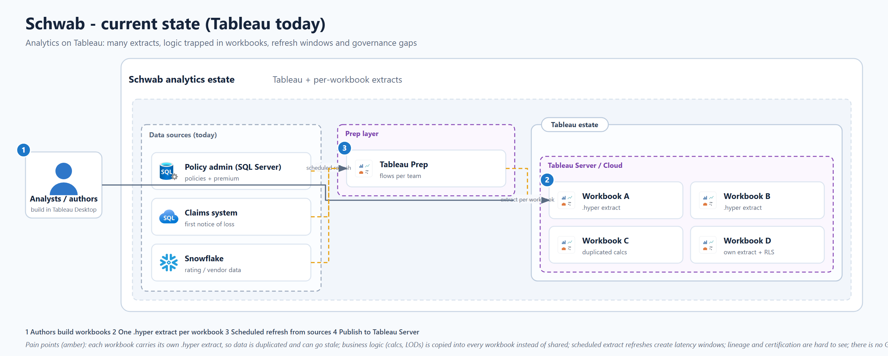
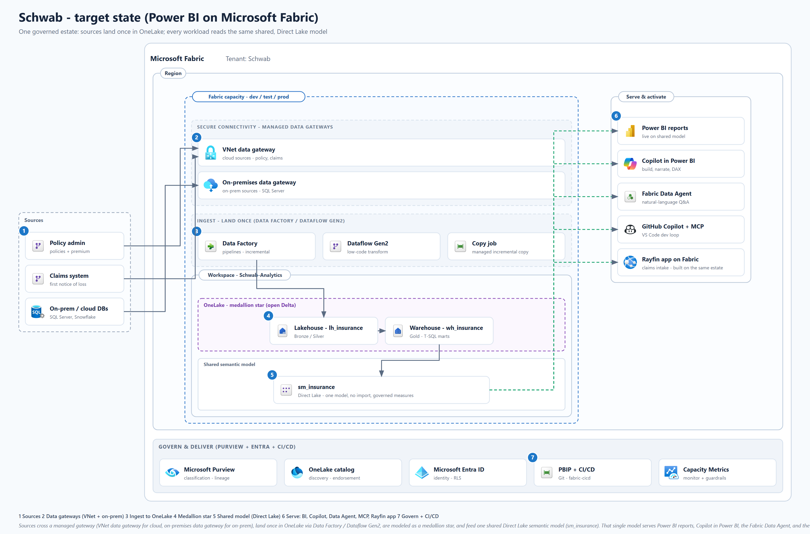

# Current-state vs target-state (Contoso Insurance)

Two polished, editable architecture views for the workshop. The `.drawio` files
open in [draw.io](https://draw.io) / the VS Code Draw.io extension; the `.svg`
and `.png` renders (in `images/`) are for the deck and for quick viewing.

## Current state - a Tableau estate today

The pain a Tableau team feels at scale:

- **One `.hyper` extract per workbook.** The same source data (policy admin,
  claims, Snowflake ratings) is copied into many extracts, so numbers drift and
  storage multiplies.
- **Logic trapped in workbooks.** Calculated fields and LOD expressions (loss
  ratio, earned premium) are re-authored in every workbook instead of shared, so
  definitions disagree.
- **Refresh windows.** Scheduled extract refreshes add latency; a report is only
  as fresh as its last extract.
- **Governance and lineage gaps.** It is hard to see what is certified, what a
  workbook depends on, or who can see what.
- **No Git or CI/CD.** Workbooks are opaque binaries, so there is no real code
  review, diff, or automated promotion.

## Target state - Power BI on Microsoft Fabric

The estate the workshop builds toward:

- **Land once, serve many.** Policy, claims, and on-prem/Snowflake sources cross a
  managed gateway (VNet data gateway for cloud, on-premises data gateway for
  on-prem), then land once in OneLake via Data Factory / Dataflow Gen2.
- **Medallion star.** Bronze / Silver / Gold in the `lh_insurance` Lakehouse (or
  the `wh_insurance` Warehouse for T-SQL), modeled as a proper star, not a wide
  extract.
- **One shared Direct Lake model.** `sm_insurance` serves every workload with no
  import and no refresh window, governed measures (loss ratio, written premium)
  defined once.
- **Serve broadly.** The same model feeds Power BI reports, Copilot in Power BI,
  the Fabric Data Agent, and the GitHub Copilot + Power BI MCP developer loop, and
  a **Rayfin app** (Contoso Claims Intake) runs on the same governed estate.
- **Governed and shipped.** Purview classification and lineage, Entra identity and
  RLS, endorsement in the OneLake catalog, and PBIP + CI/CD promotion.

## How each lab maps onto this picture

See [architecture.md](architecture.md) for the lab-by-lab mapping and the
GitHub-rendered Mermaid version of the target diagram.

## Regenerating

The generator lives in the parent repo at
`artifacts/reference-architectures/_gen_schwab_arch.py` (it needs the diagram
engine in `tools/diagramming` and the official icon sets). The workshop ships the
rendered `.drawio` / `.svg` / `.png` so it stays self-contained.
